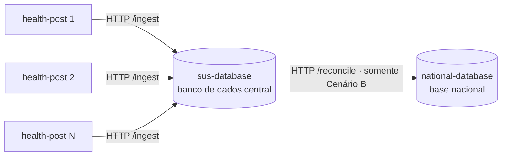
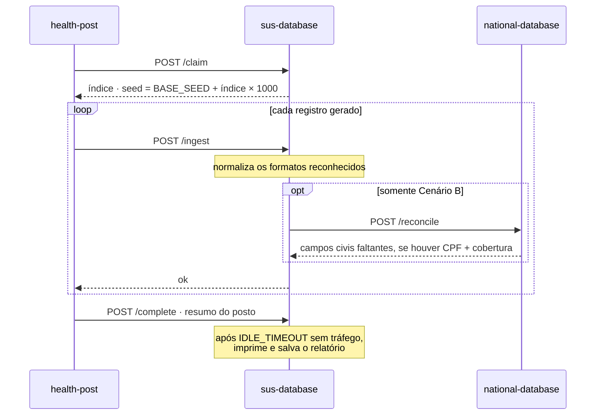

# Integração e Padronização de Dados do SUS — Simulação

Uma simulação do fluxo de dados dentro do sistema público de saúde do Brasil (o
SUS), feita para estudar o que acontece com a qualidade dos dados quando muitos
postos de saúde — cada um seguindo o seu próprio padrão de questionário — enviam
registros de pacientes a um banco de dados central, e o quanto uma base nacional
de referência pode melhorar isso.

---

## Propósito

O SUS é grande e regionalmente heterogêneo. Durante uma consulta, os dados que o
paciente informa são armazenados localmente, mas o questionário usado em cada
posto pode não bater com o padrão esperado pelo banco de dados central. O mesmo
campo acaba registrado de formas diferentes entre municípios, o que prejudica
qualquer análise entre municípios.

A simulação **mede a qualidade dos dados em dois cenários** e os compara usando
as mesmas métricas, para quantificar o valor de padronizar e integrar os dados:

- **Cenário A — sem base nacional geral.** Postos de saúde isolados enviam
  registros ao banco de dados central do SUS. O banco central consegue padronizar
  os formatos que reconhece, mas não há fonte externa de referência, então dados
  civis que chegaram faltando ou em formato irreconhecível não podem ser
  reparados.

- **Cenário B — com base nacional geral.** Uma base nacional fala apenas com o
  banco de dados central do SUS, preenchendo dados civis faltantes e corrigindo
  inconsistências que o banco central não conseguiu resolver sozinho.

Comparar os dois responde à pergunta central da proposta: *o quanto o acesso e a
usabilidade dos dados melhoram depois que uma base nacional os completa e
concilia?*

> **Status.** **Os dois cenários estão implementados.** O Cenário A roda por
> padrão; o Cenário B adiciona um container `national-database` que o banco
> central consulta para completar os dados civis que não conseguiu resolver
> sozinho. Ele foi adicionado sem alterar as camadas existentes de domínio,
> geração, padronização ou métricas — apenas um conciliador opcional foi injetado
> no núcleo do banco central (veja *Executando → Cenário B*).

---

## O que está sendo modelado

| Elemento do mundo real          | Na simulação                                               |
| ------------------------------- | ---------------------------------------------------------- |
| Posto de Saúde                  | um container `health-post` que gera e envia registros      |
| Dados locais de cada posto      | um `RegionalProfile` por posto (formatos + taxa de ausência) |
| Banco de dados central do SUS   | o container `sus-database` que padroniza e armazena        |
| Base nacional geral (B)         | um container `national-database` que o banco central consulta |
| Rede entre os atores            | a rede Docker (requisições HTTP reais)                     |
| Postos que não falam entre si   | postos só enviam mensagens ao banco, nunca a um par        |

Cada posto segue o seu próprio **perfil regional**: um estilo de CPF, um estilo
de data, um estilo de codificação de sexo e uma probabilidade de deixar campos
essenciais em branco. É isso que torna registros de postos diferentes
incompatíveis entre si.

O banco central consegue **normalizar os formatos que reconhece** (por exemplo,
transformar `01/02/1990` ou `01-02-1990` em `1990-02-01`, `1`/`Male` em `M`, um
CPF sem pontuação em `000.000.000-00`). O que ele não consegue fazer sozinho —
inventar dados civis faltantes ou irreconhecíveis — é exatamente o que a base
nacional contribui no Cenário B.

---

## Métricas

As cinco métricas do diagrama da proposta, calculadas em `SimulationReport`:

| Métrica                          | Significado                                                 |
| -------------------------------- | ----------------------------------------------------------- |
| **Taxa de acesso**               | Fração dos registros enviados que chegaram ao banco central |
| **Taxa de utilização**           | Fração dos registros integrados que são úteis para análise  |
| **Volume de dados integrado**    | Número de registros efetivamente armazenados no central     |
| **Correção de inconsistências**  | Fração das inconsistências detectadas que foram corrigidas  |
| **Tempo médio de resposta**      | Tempo médio de ida e volta por registro (ms)                |

Espera-se que a comparação mostre uma **taxa de acesso** parecida nos dois
cenários (os registros chegam de qualquer forma), enquanto as taxas de
**utilização** e **correção** sobem no Cenário B, onde a base nacional repara os
dados civis que o banco central não conseguiu consertar sozinho.

---

## Arquitetura

O projeto segue um desenho modular em camadas. As dependências apontam para
**dentro**: camadas externas conhecem as internas, nunca o contrário.

### Atores e comunicação

Cada ator é um container; a comunicação é por HTTP na rede Docker. Os postos só
falam com o banco central, e a base nacional (Cenário B) é consultada apenas pelo
banco central — nunca por um posto.



### Estrutura de arquivos

```
db_server.py                 entry point do container do banco de dados central
post_runner.py               entry point de um container health-post
national_server.py           entry point do container da base nacional (B)
Dockerfile                   uma imagem, compartilhada pelos três papéis
docker-compose.yml           banco + N postos isolados + base nacional (B)
.env                         parâmetros ajustáveis (lidos pelo Compose)
└── src/
    ├── domain/              modelos de dados do núcleo — não depende de nada
    │   └── models.py        ConsultationRecord, StandardizedRecord
    ├── standardization/     normalização de formato (padrão Strategy)
    │   └── normalizers.py   CpfNormalizer, BirthDateNormalizer, SexNormalizer
    ├── generation/          dados sintéticos com variância regional
    │   ├── regional_profile.py
    │   └── record_generator.py
    ├── national/            registro civil de referência (núcleo do Cenário B)
    │   └── national_database.py   NationalDatabase — preenche/corrige dados civis
    ├── metrics/             agregação de métricas (pura, sem transporte)
    │   └── report.py        SimulationReport
    ├── database.py          IngestionEngine — o núcleo do banco central
    └── net/                 transporte de rede (o deploy em Docker)
        ├── protocol.py          formato da comunicação + caminhos dos endpoints
        ├── server.py            servidor HTTP do banco central (embrulha IngestionEngine)
        ├── client.py            cliente HTTP do health-post
        ├── national_server.py   servidor HTTP da base nacional (embrulha NationalDatabase)
        └── national_client.py   cliente que o banco central usa para alcançá-la
```

A lógica da simulação vive em camadas sem dependência de transporte (domínio,
geração, padronização, métricas, nacional) mais o `IngestionEngine`, que
padroniza e armazena cada registro. A camada `net` é apenas o fio: ela carrega os
registros dos containers de posto até o banco central e — no Cenário B — as
requisições de conciliação do banco central até a base nacional, como requisições
HTTP reais.

### Princípios de projeto aplicados

- **Responsabilidade Única** — geração, padronização, transporte e métricas vivem
  cada um em seu próprio módulo.
- **Aberto/Fechado** — suportar um novo campo significa adicionar um normalizador;
  nenhuma classe existente muda.
- **Inversão de Dependência** — o `IngestionEngine` depende do *protocolo*
  `FieldNormalizer`, não dos normalizadores concretos (eles são injetados).
- **Testabilidade** — as camadas de domínio, padronização e métricas são livres de
  qualquer preocupação de transporte e podem ser testadas isoladamente.
- **Reprodutibilidade** — toda escolha aleatória é guiada por seed. Fixar o índice
  de cada posto faz o seu seed ser `BASE_SEED + index*1000`, então uma execução se
  torna totalmente repetível e dois cenários reutilizam exatamente os mesmos dados
  (veja a nota de reprodutibilidade em *Executando*).

### Por que o modelo de atores

Postos e o banco de dados rodam como containers separados que se comunicam
**apenas** por requisições HTTP através da rede Docker. Isso espelha de verdade os
containers isolados da proposta: cada posto é o seu próprio container, sem rota
até os pares, e o único destino legítimo para os dados de um posto é o banco de
dados central.

### Fluxo de uma execução

Ao iniciar, cada posto reivindica um índice reprodutível, gera seus registros e
os envia um a um. No Cenário B, o banco central consulta a base nacional para
cada registro. Quando o tráfego cessa, o banco imprime e salva o relatório.



---

## Executando

A simulação roda inteiramente em Docker — um container por ator. A máquina host
precisa de Docker com Compose v2 e Python 3 (apenas biblioteca padrão, sem
dependências de terceiros) para disparar a execução.

### Um comando — a comparação A × B

Como todo o objetivo é comparar os dois cenários, esse é o comando único que você
roda:

```bash
python main.py
```

Ele roda **os dois cenários como execuções reais de container** sobre os mesmos
dados e imprime as cinco métricas lado a lado (detalhes em *Comparando A × B num
comando*, abaixo). Isto é tudo de que você precisa — os comandos por cenário na
próxima seção são opcionais e só servem para inspecionar um cenário isolado.

### Rodando um cenário isolado (opcional)

O `main.py` já roda os dois por baixo dos panos, mas você também pode disparar
cada cenário sozinho:

```bash
# Cenário A — postos isolados + banco central (padrão, sem base nacional)
docker compose up --build

# Cenário B — adiciona a base nacional que completa os dados civis
SCENARIO=B docker compose --profile scenario-b up --build
```

```powershell
# Equivalentes no PowerShell
docker compose up --build
$env:SCENARIO="B"; docker compose --profile scenario-b up --build
```

As únicas diferenças são a flag **`--profile scenario-b`** (que sobe o container
extra `national-database`) e **`SCENARIO=B`** (que diz ao banco central para
consultá-la). Todo o resto — postos, escala, ajustes, o relatório final —
funciona igual nos dois. Detalhes do Cenário B estão na *sua própria seção*
abaixo.

### Cenário A (padrão)

Rode pela primeira vez (o `--build` constrói a imagem):

```bash
docker compose up --build
```

Isso sobe um container `sus-database` e cinco containers `health-post` numa rede
Docker compartilhada. Cada posto submete seus registros ao banco via HTTP; assim
que os postos ficam quietos, o banco imprime o relatório final nos seus logs e
cada container encerra sozinho.

> Rode com um `docker compose up` simples, **não** com `--abort-on-container-exit`:
> essa flag mata o banco no instante em que o primeiro posto encerra, antes que
> ele consiga imprimir o relatório.

### Você não precisa de `--build` toda vez

O `--build` só reconstrói a imagem, o que é necessário **depois que você muda o
código ou o Dockerfile**. Em qualquer outra execução, basta usar:

```bash
docker compose up
```

Ele reaproveita a imagem `sus-sim:latest` já construída (uma imagem só,
compartilhada pelo banco e por todos os postos — nada é duplicado por posto).

### Limpando (opcional)

Os containers param sozinhos quando a execução termina, mas ficam no disco em
estado "exited". Para removê-los e à rede:

```bash
docker compose down
```

Isso é só arrumação — você pode rodar `docker compose up` de novo sem fazer isso.
Vale a pena quando você *diminui* o número de postos (por exemplo, voltou de
`--scale health-post=8` para 3), para que os containers restantes não fiquem como
órfãos.

### Mudando o número de postos

O número de postos é só quantas réplicas do serviço `health-post` você pede — o
banco as descobre em tempo de execução, nada mais precisa mudar:

```bash
docker compose up --scale health-post=8
```

Cada réplica reivindica um índice distinto (`0, 1, 2, …`) do banco ao iniciar e
deriva o seu seed como `BASE_SEED + index*1000`, então cada posto ganha seu
próprio perfil regional automaticamente — e a população é reprodutível entre
execuções (veja *Relatório salvo (JSON + CSV)*).

### Cenário B — adicionando a base nacional

O Cenário B sobe um terceiro ator: o container `national-database`. O banco
central o consulta para cada registro, pedindo que ele forneça os campos civis
essenciais que não conseguiu completar sozinho. A base nacional fala apenas com o
banco central — os postos nunca a veem.

Ela vive atrás de um **profile** do Compose, então o Cenário A continua um
`docker compose up` simples. Para rodar o Cenário B, ative o profile e defina
`SCENARIO=B` para que o banco central saiba que deve consultá-la:

```bash
# bash
SCENARIO=B docker compose --profile scenario-b up --build
```

```powershell
# PowerShell
$env:SCENARIO="B"; docker compose --profile scenario-b up --build
```

A base nacional **não** é um oráculo. Dois limites do mundo real mantêm o
Cenário B abaixo de uma pontuação perfeita, como a proposta espera:

- **Identificação** — um paciente só pode ser consultado por meio de um CPF
  utilizável. Um registro cujo CPF chegou faltando não pode ser correspondido,
  então continua incompleto.
- **Cobertura** — o registro contém apenas uma fração `COVERAGE` dos pacientes
  identificáveis (padrão `0.9`); o restante não pode ser completado mesmo depois
  de identificado.

Comparado ao Cenário A sobre os mesmos dados, a **taxa de acesso** permanece igual
(os registros chegam de qualquer jeito), enquanto as taxas de **utilização** e
**correção de inconsistências** sobem, quantificando exatamente o que a base
nacional acrescenta.

### Comparando A × B num comando

As execuções em Docker acima rodam um cenário por vez. O `main.py` roda **os
dois, cada um como uma execução real de container**, sobre os mesmos dados e
imprime as cinco métricas lado a lado com o delta B − A — o objetivo central da
proposta:

```bash
python main.py
```

Ele orquestra o Docker: sobe o Cenário A, espera o banco finalizar, depois o
Cenário B, e lê os dois relatórios que ambas as execuções salvaram em `./reports`
(nada é simulado no host). Ele grava `report-comparison.json` / `.csv` e respeita
as mesmas variáveis `POSTS`, `CONSULTATIONS`, `BASE_SEED` e `COVERAGE`. Como cada
posto reivindica um **índice reprodutível** do banco (seed = `BASE_SEED +
index*1000`), as duas execuções geram registros idênticos, então `access_rate` e
`integrated_volume` batem e toda diferença é atribuível só à base nacional.

> Já rodou A e B por conta própria? `RUN_SCENARIOS=0 python main.py` pula as
> execuções de container e apenas reagrega os relatórios já em `./reports`.

### Ajustando os parâmetros

Os parâmetros ajustáveis ficam no arquivo [`.env`](.env), que o Compose lê
automaticamente. Edite um valor lá e rode `docker compose up` de novo:

```bash
POSTS=5             # número de postos de saúde (também ajustável com --scale)
CONSULTATIONS=200   # consultas que cada posto gera
BASE_SEED=42        # seed aleatório base (desloca toda a população)
IDLE_TIMEOUT=5      # segundos de silêncio antes de finalizar o relatório
```

Você também pode sobrescrever qualquer um deles para uma única execução, sem
editar o arquivo:

```powershell
# PowerShell
$env:BASE_SEED=7; $env:CONSULTATIONS=500; docker compose up
```

```bash
# bash
BASE_SEED=7 CONSULTATIONS=500 docker compose up
```

| Variável        | Padrão  | Descrição                                              |
| --------------- | ------- | ------------------------------------------------------ |
| `POSTS`         | 5       | Número de postos de saúde (também ajustável com `--scale`) |
| `CONSULTATIONS` | 200     | Consultas geradas por posto                            |
| `BASE_SEED`     | 42      | Desloca toda a população de postos                     |
| `IDLE_TIMEOUT`  | 5       | Segundos de silêncio antes de finalizar o relatório    |
| `SCENARIO`      | A       | `A` (isolado) ou `B` (consulta a base nacional)         |
| `COVERAGE`      | 0.9     | Cenário B: fração de pacientes identificáveis cadastrados |
| `REPORT_DIR`    | reports | Onde o relatório também é salvo em JSON + CSV           |
| `POST_INDEX`    | —       | Fixa um posto num índice específico em vez de reivindicar |

O endpoint `GET /report` do banco também é publicado em `localhost:8000` caso você
queira consultar as métricas enquanto uma execução está em andamento.

### Relatório salvo (JSON + CSV)

Além de imprimir no log, o banco central escreve o relatório final em
`REPORT_DIR` (montado em **`./reports`** no host) quando a execução termina:

- `report-scenario-<a|b>.json` — o relatório completo (cada métrica mais a quebra
  por campo).
- `report-scenario-<a|b>.csv` — apenas a tabela de quebra por campo, pronta para
  uma planilha.

O nome do arquivo carrega o cenário, então uma execução do Cenário A e uma do
Cenário B ficam lado a lado em vez de sobrescrever uma à outra — que é como você
as compara.

> **Reprodutibilidade.** Cada posto reivindica o próximo índice (`0, 1, 2, …`) do
> banco ao iniciar e monta o seu seed como `BASE_SEED + index*1000`. A população é,
> portanto, a união desses seeds — totalmente determinada por `BASE_SEED` e pelo
> número de postos, não importa qual container reivindicou qual índice — então
> `--scale health-post=N` é reprodutível entre execuções e uma execução do Cenário
> A e uma do Cenário B geram exatamente os mesmos registros. Fixe `POST_INDEX` para
> amarrar um posto específico a um seed específico.

### Exemplo de saída

```
=== Simulation report: Scenario A - no national general database (Docker) ===

  Access rate ............... 100.00%   (1000/1000 records)
  Utilization rate ..........  41.10%   (411/1000 analysis-ready)
  Integrated data volume .... 1000 records
  Inconsistency correction ..  59.08%   (1240/2099 fixed)
  Average response time ..... 1.89 ms

  Missing civil data by field (recovered by national base):
    cpf ..........  208 missing,    0 recovered
    birth_date ...  217 missing,    0 recovered
    sex ..........  219 missing,    0 recovered
    city .........  215 missing,    0 recovered
```

Rodando os mesmos dados sob o Cenário B, a taxa de acesso não muda enquanto a
utilização e a correção sobem — e a quebra mostra exatamente onde: a base nacional
recupera `birth_date`, `sex` e `city`, mas **nunca `cpf`**, porque sem um CPF o
paciente não pode ser identificado em primeiro lugar.

```
=== Simulation report: Scenario B - with national general database (Docker) ===

  Access rate ............... 100.00%   (1000/1000 records)
  Utilization rate ..........  75.80%   (758/1000 analysis-ready)
  Integrated data volume .... 1000 records
  Inconsistency correction ..  81.04%   (1701/2099 fixed)
  Average response time ..... 2.40 ms

  Missing civil data by field (recovered by national base):
    cpf ..........  208 missing,    0 recovered
    birth_date ...  217 missing,  154 recovered
    sex ..........  219 missing,  152 recovered
    city .........  215 missing,  155 recovered
```
